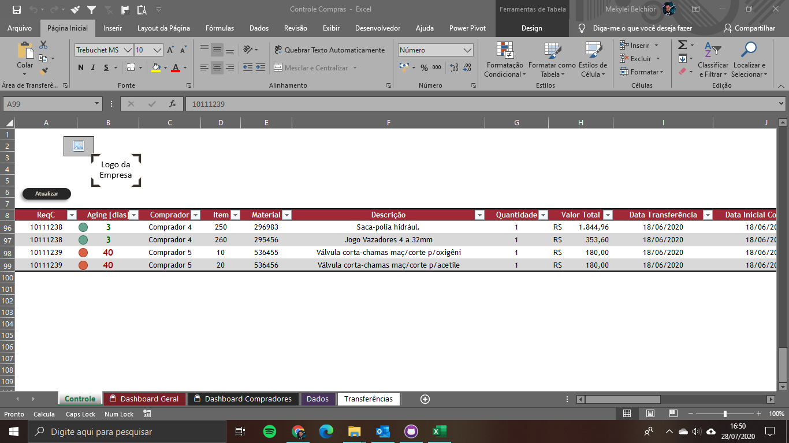
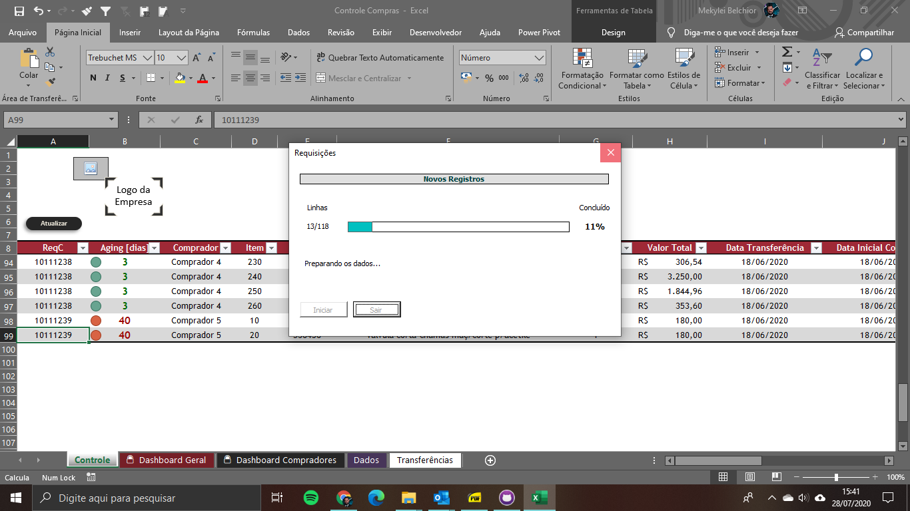
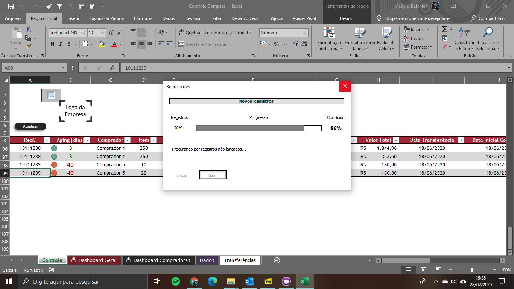
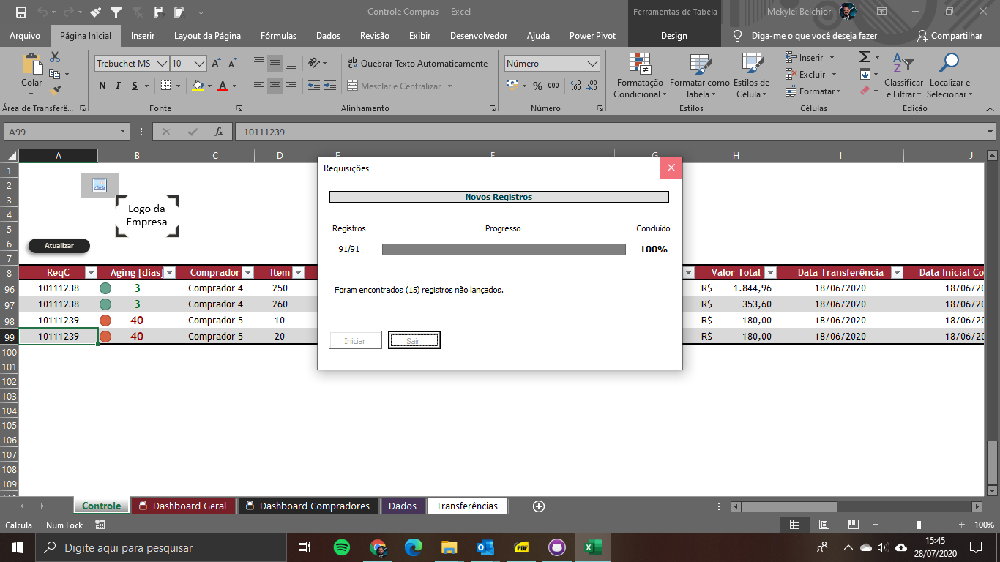
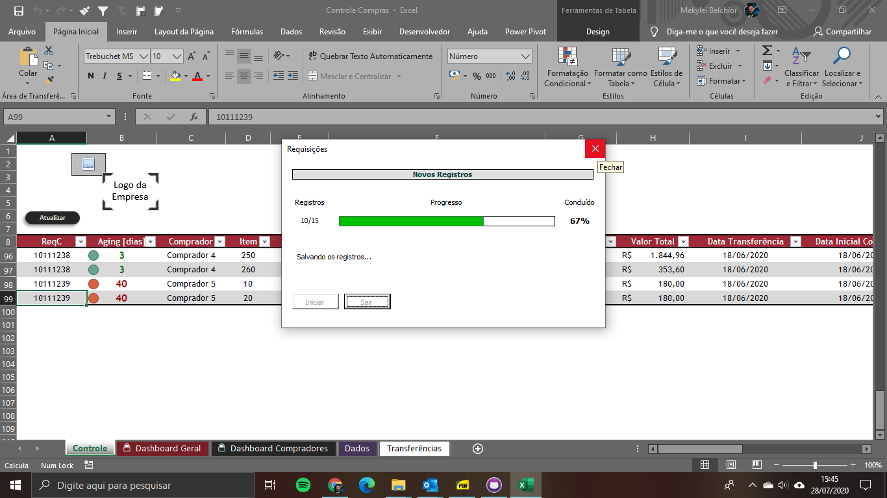
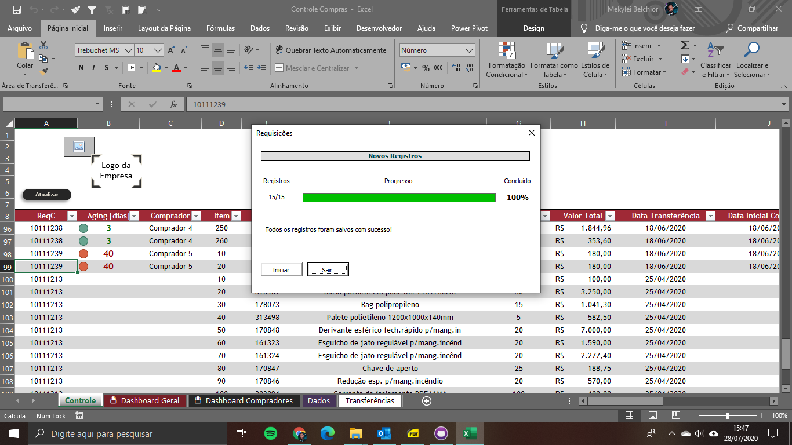
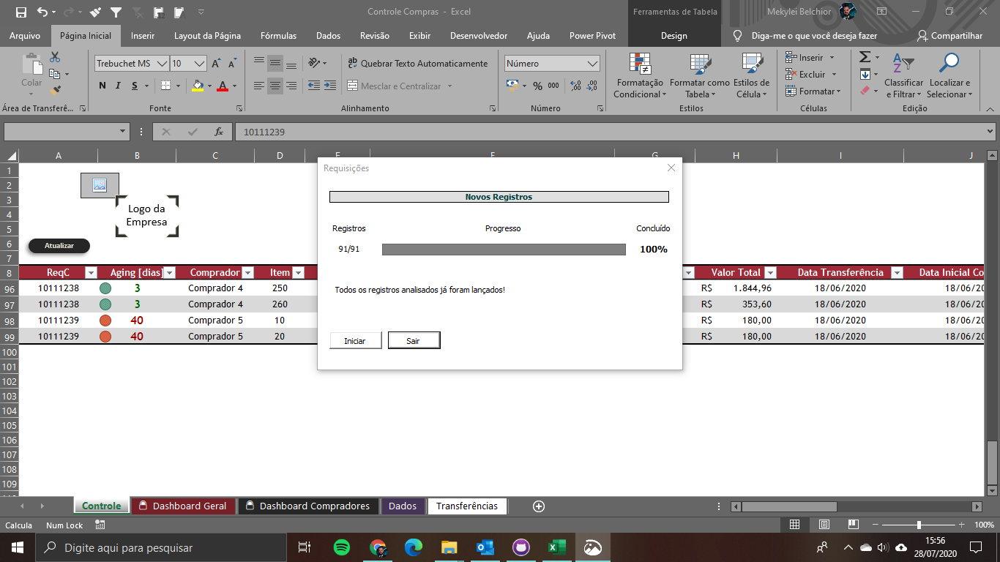

# CONTROLE DE REQUISIÇÕES E ITENS DE COMPRAS  
Controle desenvolvido para atender uma demanda ao qual necessitava controlar cada item direcionado a um comprador e o status de atendimento deste item.  

Software: Excel 2019 Professional Plus  
Resolução ideal da tela: 1366 x 768  
**Utilizado: Tabelas, validação de dados, formatação condicional, conjunto de ícones, formas, fórmulas, funções e código VBA.**  
Bloqueio do Código: Não 

## Observações    
Os dados que já se encontram inseridos nas guias da pasta de trabalho são meramente fictícios e com a simples finalidade de evidênciar as funcionalidades do controle. 

## Demanda  
- Criar um controle simples e prático em MS Excel para gerenciar as atividades de compras que são realizadas em uma plataforma eletrônica. 
- Inserir sinalizadores de tempo de atendimento para cada item e validações que facilitem a inserção de dados.  
- Implementar uma funcionalidade que faça a verificação e importação de novos itens automáticamente de uma planilha extraída de um outro sistema auxíliar.  
- Criar análise visuais.  

## Implementações  

### Guia de controle  

  

### Análise e importação de dados  

  

  

  

  

  

  

